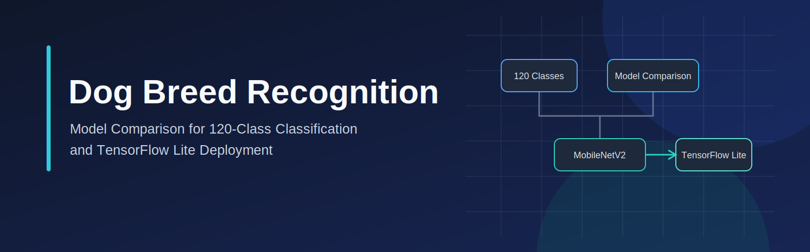
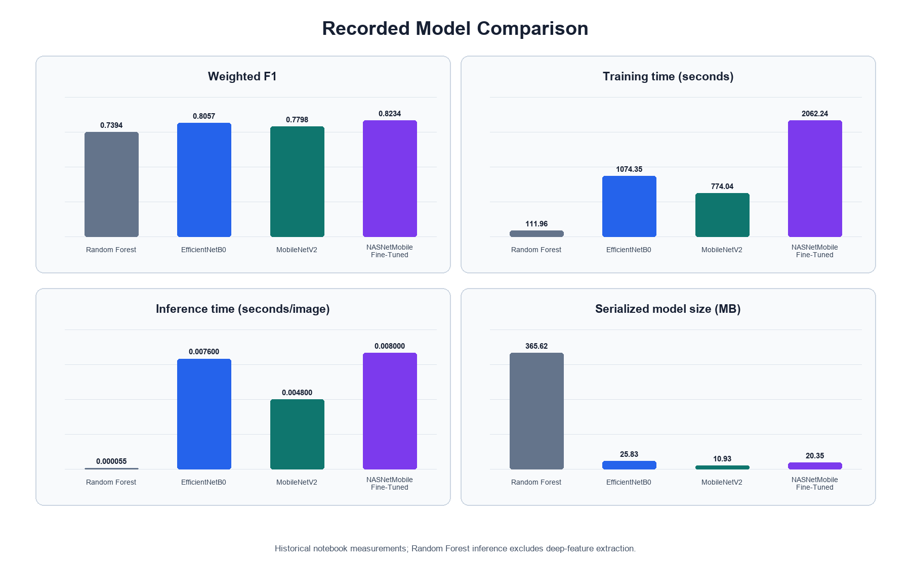
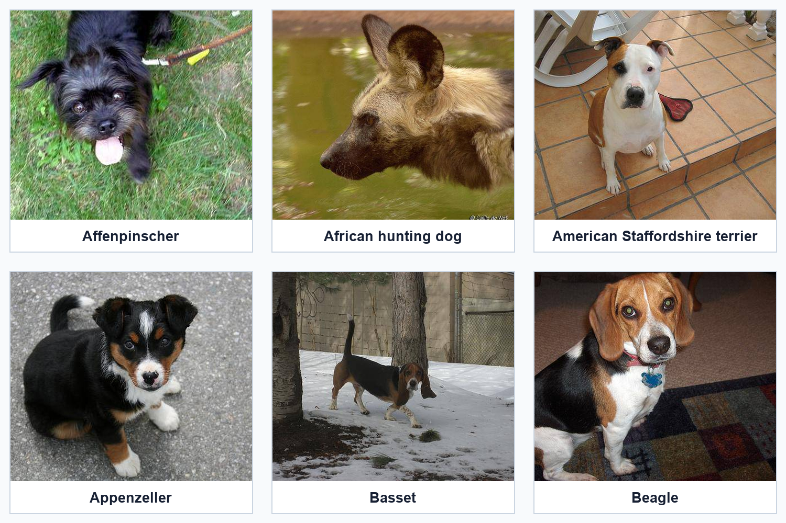
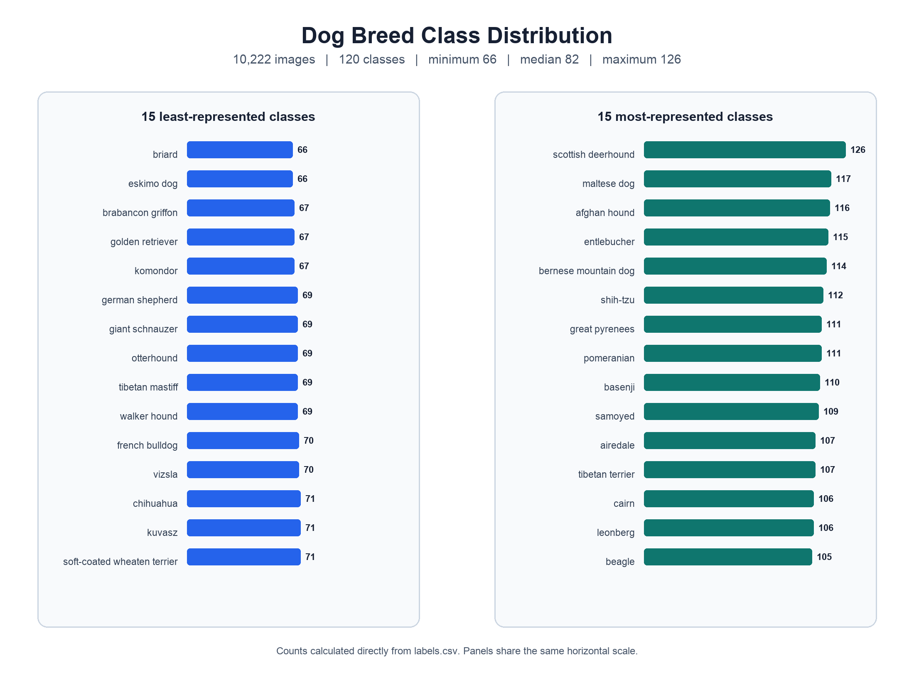
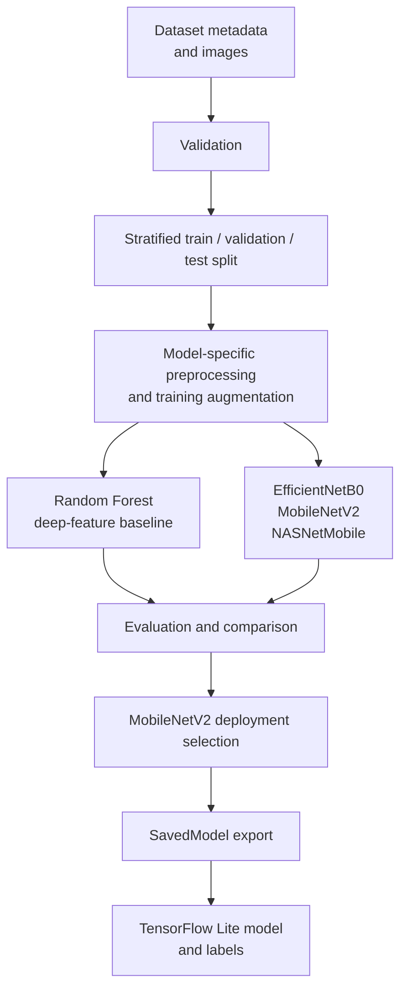
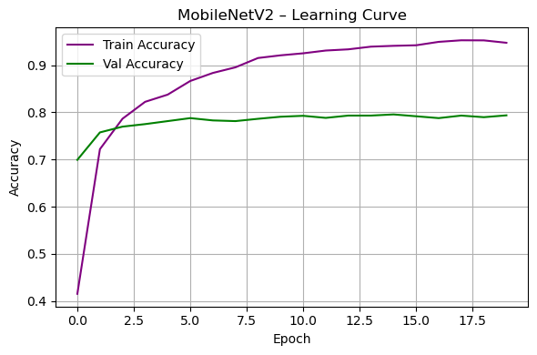

<p align="center">
  
</p>

# Dog Breed Recognition

**Model Comparison for 120-Class Classification and TensorFlow Lite Deployment**

A 120-class computer vision project comparing a Random Forest baseline with EfficientNetB0, MobileNetV2, and fine-tuned NASNetMobile, then selecting MobileNetV2 for a lightweight TensorFlow Lite deployment workflow.

Built around the public Kaggle Dog Breed Identification dataset, this repository evaluates classification quality alongside training time, inference time, and serialized model size. Fine-tuned NASNetMobile recorded the highest weighted F1 score; MobileNetV2 was selected for the deployment path as the more compact, faster recorded CNN candidate. A TensorFlow Lite model and its ordered label file are included.

**[Open the main training and evaluation notebook](train_dog_breed_model/train_dog_breed_model.ipynb)** · [Open the TensorFlow Lite conversion notebook](train_dog_breed_model/convert_tflite.ipynb) · [View the recorded results](train_dog_breed_model/all_model_results.json)

## Project Highlights

- 10,222 labelled images across 120 dog breed classes.
- Stratified training, validation, and test splits containing 5,110, 2,045, and 3,067 images respectively.
- Random Forest baseline trained on deep features extracted with ImageNet-pretrained MobileNetV2.
- Transfer-learning experiments with EfficientNetB0, MobileNetV2, and NASNetMobile, including a NASNetMobile fine-tuning stage.
- Comparison based on weighted F1, recorded training time, recorded inference time per image, and serialized model size.
- MobileNetV2 selected for the deployment workflow; fine-tuned NASNetMobile retained the highest recorded weighted F1.
- Included TensorFlow Lite artifact and 120-class label file for the lightweight deployment path.

## Technology Stack

| Area | Technologies |
|---|---|
| Language and environment | Python, Jupyter Notebook |
| Deep learning | TensorFlow, Keras |
| Machine learning | scikit-learn |
| Data processing | NumPy, pandas |
| Visualisation | Matplotlib, Seaborn, Plotly |
| Model deployment | TensorFlow Lite |
| Supporting tools | Pillow, joblib |

## Results at a Glance

The table below uses the retained values in [`all_model_results.json`](train_dog_breed_model/all_model_results.json).

| Model | F1 | Train (s) | Inference (s/img) | Size (MB) |
|---|---:|---:|---:|---:|
| Random Forest | 0.7394 | 111.96 | 0.000055 | 365.62 |
| EfficientNetB0 | 0.8057 | 1074.35 | 0.0076 | 25.83 |
| MobileNetV2 | 0.7798 | 774.04 | 0.0048 | 10.93 |
| NASNetMobile FT | 0.8234 | 2062.24 | 0.0080 | 20.35 |

F1 means weighted F1, and inference is measured in seconds per image. Random Forest inference excludes MobileNetV2 feature extraction. All values are historical notebook measurements.

Fine-tuned NASNetMobile recorded the highest weighted F1. MobileNetV2 was selected for the deployment workflow because it produced the smallest compared model artifact and faster recorded CNN inference while retaining competitive classification performance.

Random Forest timing covers classification of pre-extracted features and does not include MobileNetV2 feature-extraction latency. All timings are historical measurements from the recorded notebook runs, not controlled cross-hardware benchmarks.



*Recorded comparison across four independent metrics. Each panel uses its own scale; Random Forest inference excludes deep-feature extraction.*

## Problem and Dataset

Dog breed recognition is a fine-grained image-classification task: the system must learn differences across many related visual categories while remaining practical for the intended deployment path. This project treats model choice as a trade-off rather than an accuracy-only decision.

The project uses the [Kaggle Dog Breed Identification dataset](https://www.kaggle.com/competitions/dog-breed-identification/data):

- 10,222 labelled images represented by `labels.csv`;
- 120 breed classes;
- image IDs mapped to breed names through [`labels.csv`](train_dog_breed_model/dataset_dog_breed_identification/labels.csv);
- stratified 49.99% / 20.01% / 30.00% training, validation, and test splits using `random_state=42`.

The full image dataset is excluded from this repository because of repository size and redistribution considerations. Users should download it from the original Kaggle source rather than expect it in a clone. See the [dataset setup instructions](train_dog_breed_model/dataset_dog_breed_identification/README.md) before running the notebooks.

### Sample Images from the Dataset



*Representative dog-breed images from the publicly available Kaggle Dog Breed Identification dataset used by this project. These six examples illustrate variation in breed appearance, pose, lighting, and background; the full dataset is not included.*

### Class Distribution



Class counts range from 66 to 126 images, with a median of 82 across all 120 breeds. This shows measurable variation in class representation while retaining at least 66 labelled examples for every breed.

## Engineering Workflow



The notebook workflow covers:

1. Metadata loading and checks for missing values, duplicate IDs, class distribution, and image availability.
2. Stratified train/validation/test splitting.
3. 224 × 224 image generators with architecture-specific preprocessing.
4. Training-only augmentation using rotation, zoom, shifts, shear, brightness variation, and horizontal flipping.
5. Balanced class weights and persisted class-index mappings.
6. Classical and transfer-learning model training, evaluation, artifact recording, and comparison.
7. MobileNetV2 SavedModel export followed by TensorFlow Lite conversion.

Validation and test data use model-specific preprocessing without augmentation. The conversion notebook is preserved as the record of the existing TensorFlow Lite workflow.

## Models and Training Approach

### Random Forest

The classical baseline uses ImageNet-pretrained MobileNetV2 as a fixed feature extractor. A class-balanced Random Forest is tuned with `RandomizedSearchCV` and evaluated on the resulting deep feature vectors. Its very small recorded classifier inference time must be interpreted separately from feature-extraction latency.

### EfficientNetB0

EfficientNetB0 uses an ImageNet-pretrained, frozen convolutional base with a custom classifier. Training uses class weights, early stopping, and learning-rate reduction.

### MobileNetV2

MobileNetV2 uses an ImageNet-pretrained frozen base with global average pooling and a compact classification head. It produced the smallest compared model artifact at 10.93 MB and was selected as the deployment candidate for the TensorFlow Lite path.



*Training and validation accuracy preserved from the existing MobileNetV2 notebook output. The notebook was not rerun to create this asset.*

The widening gap between training and validation accuracy indicates that further regularisation or fine-tuning control could improve generalisation.

### NASNetMobile

NASNetMobile uses ImageNet-pretrained weights, base training, and a subsequent lower-learning-rate fine-tuning stage. The fine-tuned model recorded the highest weighted F1 score in the retained comparison results: 0.8234.

## Evaluation and Model Selection

The comparison records weighted F1 on the held-out test split, elapsed training time, measured inference time per image, and serialized model size. These dimensions expose the practical distinction between the highest classification score and the selected deployment trade-off.

- **Highest recorded weighted F1:** NASNetMobile (Fine-Tuned), 0.8234.
- **Selected deployment model:** MobileNetV2, with weighted F1 0.7798, recorded CNN inference of 0.0048 seconds per image, and a 10.93 MB serialized model.
- **Classical baseline consideration:** Random Forest offers fast classification after features are available, but its serialized artifact is 365.62 MB and its timing excludes feature extraction.

The README intentionally does not present the selected MobileNetV2 model as the highest-performing classifier. Its selection reflects the recorded balance of classification performance, compactness, and CNN inference time for the intended lightweight deployment workflow.

## TensorFlow Lite Deployment

The main notebook exports the selected MobileNetV2 model to TensorFlow SavedModel format. The [conversion notebook](train_dog_breed_model/convert_tflite.ipynb) then converts that export using TensorFlow Lite's default optimisation setting and built-in operations, and creates the ordered labels file from the MobileNetV2 class-index mapping.

Included deployment artifacts:

- [`mobilenet_dogbreed.tflite`](dog_prepare_tflite/mobilenet_dogbreed.tflite) — 2,672,976 bytes, approximately 2.55 MiB;
- [`labels.txt`](dog_prepare_tflite/labels.txt) — 120 ordered class labels;
- [`class_indices_mobilenet.json`](train_dog_breed_model/class_indices_mobilenet.json) — class-to-index mapping.

The repository does not provide a controlled Keras-versus-TFLite parity benchmark or Android-device latency evaluation. The Android application is a separate project and is not included here.

## Repository Structure

```text
dog-breed-recognition/
├── README.md
├── LICENSE
├── requirements-train.txt
├── requirements-tflite.txt
├── docs/
│   └── images/
│       ├── class_distribution.png
│       ├── dog_breed_recognition_banner.svg
│       ├── dataset_sample_grid.png
│       ├── model_comparison.png
│       └── mobilenetv2_learning_curves.png
├── dog_prepare_tflite/
│   ├── labels.txt
│   └── mobilenet_dogbreed.tflite
└── train_dog_breed_model/
    ├── train_dog_breed_model.ipynb
    ├── convert_tflite.ipynb
    ├── all_model_results.json
    ├── class_indices_efficientnet.json
    ├── class_indices_mobilenet.json
    ├── class_indices_nasnet.json
    └── dataset_dog_breed_identification/
        ├── README.md
        └── labels.csv
```

Trained Random Forest, Keras, SavedModel, and generated prediction-array artifacts are excluded from Git. The TensorFlow Lite model is included.

## Setup and Dataset Installation

The training and conversion notebooks record different Python environments, so separate environments are recommended.

### Training environment

The main notebook metadata records Python 3.12.7. Its dependencies are listed without invented version pins:

```bash
python -m venv .venv-train
source .venv-train/bin/activate
python -m pip install -r requirements-train.txt
```

### TensorFlow Lite conversion environment

The conversion notebook records Python 3.10.18, TensorFlow 2.14.0, and NumPy 1.26.4:

```bash
python3.10 -m venv .venv-tflite
source .venv-tflite/bin/activate
python -m pip install -r requirements-tflite.txt
```

### Dataset placement

Download the data manually from the [official Kaggle competition page](https://www.kaggle.com/competitions/dog-breed-identification/data), review the applicable terms, and place the training JPG files at:

```text
train_dog_breed_model/
└── dataset_dog_breed_identification/
    ├── labels.csv
    └── main_dataset/
        ├── <image-id>.jpg
        └── ...
```

Run the notebooks with `train_dog_breed_model/` as the working directory because their paths are relative to that location. ImageNet weights requested by the Keras application models may require internet access or an existing Keras cache.

The dataset and ignored training artifacts are not downloaded automatically. Training, feature extraction, and Random Forest hyperparameter search may take substantial time.

## Reproducibility, Limitations, and Future Work

### Reproducibility notes

- The dataset must be downloaded manually and restored at the expected path.
- Split operations and the training generator use fixed seeds, but full cross-platform determinism is not claimed.
- Notebook outputs are retained from historical completed runs; execution counts are non-sequential and were not modified during repository preparation.
- Stored timings are hardware-dependent historical measurements.
- Keras, Random Forest, SavedModel, and prediction-array artifacts are ignored; a normal clone includes the TFLite model but not those training artifacts.
- The project does not provide one-command reproduction or locked training dependencies.

### Limitations

- The full dataset is not bundled; only the six attributed README samples are included.
- Timing was not measured under a controlled cross-hardware protocol.
- Random Forest inference excludes deep-feature extraction.
- No controlled Keras-versus-TFLite parity evaluation is included.
- No Android-device latency benchmark is included.
- Training and conversion used different recorded Python environments.
- Ignored trained-model artifacts are absent from a public clone.

### Future work

- Add reviewed environment lock files and validate a clean-kernel execution path.
- Introduce controlled Keras-versus-TFLite parity testing.
- Benchmark the TFLite model on representative mobile hardware.
- Evaluate quantisation and model-compression variants as separate experiments.
- Add a lightweight, verified inference interface.

## Contributors, Licence, Attribution, and Links

This project was developed by Alireza Zaeri and Fatemeh Sabourinia.

- [Alireza Zaeri — GitHub](https://github.com/alirezazaeri)
- [Alireza Zaeri — LinkedIn](https://linkedin.com/in/alirezazaeri)

### Licence and attribution

Original repository code is available under the [MIT License](LICENSE), copyright © 2026 Alireza Zaeri and Fatemeh Sabourinia.

The Kaggle Dog Breed Identification dataset remains subject to its [original source terms](https://www.kaggle.com/competitions/dog-breed-identification/data) and is not covered by this repository's MIT License. TensorFlow/Keras pretrained architectures and ImageNet weights remain subject to their respective third-party licences and terms.

### Related links

- [GitHub profile](https://github.com/alirezazaeri)
- [LinkedIn](https://linkedin.com/in/alirezazaeri)
